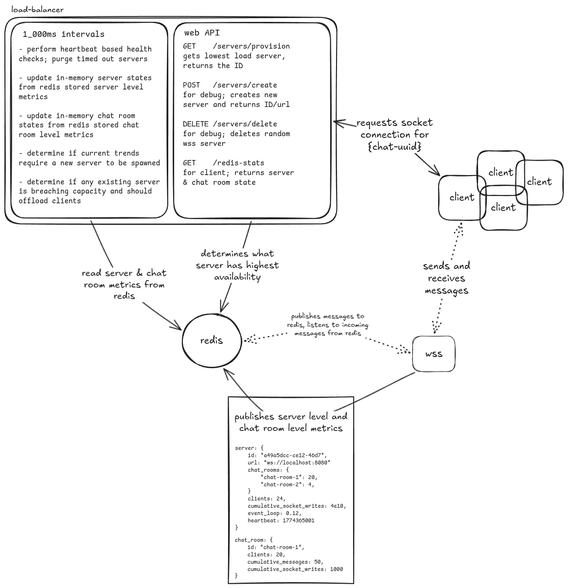

# Chat



Over the past few weeks I've been working on a distributed, real-time chat system with the intention of reproducing
the chat services you see in livestreams. In the end, I converged upon a repository with four projects. Two are a
websocket chat server and a load balancer, and two that are AI generated helpers - a metrics visualizer and a test
harness that simulates large scale chat load. On the topic of AI, I did my best to **not** leverage it in the
implementations of the chat server and load balancer, though it did sneak in here and there. My goals here weren't to
learn about vibe coding - they were to learn about small distributed systems and high bandwidth chat systems.

## The Chat Server

### _Pub/Sub_

I'd never spent any time using Redis beyond a Laravel cache driver, and when I found out about
its pub-sub system it immediately opened up the door to a project I had poked around on years
ago but ultimately failed with; a distributed, websocket driven real-time chat system.

I had heard of the pub-sub pattern but never used it day to day - in short, a publisher more or
less shouts a message into the void, not caring who is there to hear it. Subscribers can listen
for messages, scoped by what is referred to as a _channel_ in Redis' case.

In code (using [`node-redis`](https://www.npmjs.com/package/redis)), it looks something like this:

```typescript
redisClient.subscribe("some-channel", (message: string) =>
    console.log(JSON.parse(message)),
);

redisClient.publish(
    "some-channel",
    JSON.stringify({
      some: "data",
    }),
);
```

This concept, I've since learned, is known as _fanout_ - the distribution of a message across
multiple processes. Crucially, it enables multiple websocket servers to manage the same chat
room simultaneously; if a client connected to `server-a`, that message can be _fanned out_ to
clients connected to `server-b` using Redis' pub-sub system.

In practice, it works something like this:

1. Two clients, `client-a` and `client-b` are connected to `server-a` and `server-b` respectively.
2. `client-a` sends a message over its websocket connection to `client-a`.
3. `server-a` receives this message, publishes it to Redis on the chat channel, and does nothing else with it:

   ```typescript
   client.on("message", async (rawData) => {
     const message = JSON.parse(
       rawData.toString(),
     ) as WebSocketMessage<unknown>;

     switch (message.type) {
       case "chat":
         void publishChat(message as WebSocketMessage<ChatPayload>, client);
         break;
       // ...
     }
   });

   // ...

   const publishChat = async (
     message: WebSocketMessage<ChatPayload>,
     socket: ClientSocket,
   ) => {
     if (!socket.chatId) {
       return;
     }

     void redisClient.publish(socket.chatId, JSON.stringify(message.payload));
   };
   ```

4. `server-a` and `server-b` are subscribed to the respective chat channel, and distributes these received
   messages to its clients:
   ```typescript
   await subscriber.subscribe(chatChannel, (message: string) => {
     // the real implementation doesn't immediately iterate over chat channel
     // sockets and forward the message to each of them, but for clarity that
     // is how i'll show it here :)
     const room = rooms.get(/* chat room ID */);
     room.clients.forEach((socket) => {
       socket.send(message);
     });
   });
   ```

This is the basic back-and-forth between clients, servers and Redis; clients send messages, servers push incoming
messages to Redis, Redis fans these messages out to each server, and servers push Redis-provided messages to the
appropriate clients.

### Calculating Server Load

The process of fanning messages out across multiple servers and the subsequent process of each server writing
these messages to potentially hundreds of users who, in turn, are sending cumulatively hundreds of messages per
second, leads to quite a high load on the websockets. Because of this, it's useful to have a simple
calculation to determine the total load on the system as measured in cumulative websocket connection writes per
second.

Given $r$ is the number of chat rooms being serviced (5 chat rooms), $u$ is the number users connected to the chat
service (100 users), and $m$ is the average interval at which messages are sent (every 30 seconds), we can
derive the following formula:

$$
\mathrm{r}=\text{rooms},\quad
\mathrm{u}=\text{users},\quad
\mathrm{m}=\frac{t_{min}+t_{max}}{2}
$$

$$
f(r,u,m)=\frac{u^2}{mr}
$$

$$
f(5, 100, 30) = \frac{100^2}{5 \cdot 30} = 66.67\text{ socket writes per second}
$$

Given these calculations, and an observed maximum of _about_ ~75,000 socket writes per second per server, we
can easily determine the number of servers we'll need to service users in any given circumstance.

#### _"but Ryan, this calculation is too simplistic!"_

Yeah, it is - for instance this projection (and most of my testing) naively assumes an equal distribution of
users per room, where in reality some chat rooms will have far more users than others. Regardless, this formula
proved incredibly useful for testing purposes and, in a pinch, I'm sure would prove a useful calculation even in
a production environment. Regardless, it could be greatly improved by removing the room parameter entirely and
running this calculation on a per-room basis.

### Chat Server State

Beyond managing socket messages and Redis pub-sub, the chat server is responsible for publishing performance metrics
every second and publishing its own metadata through sorted sets and hash entries. Additionally, it contributes to chat
room metrics as well.

Sorted sets are used for:

- \# of clients on a server (`servers:clients`)
- \# of clients per chat room (`chat-rooms:clients`)
- Cumulative socket writes (`servers:cumulative-socket-writes`)
- Event loop timeouts (`servers:event-loop`)

...and hash sets are used for server metadata (under `server:{uuid}`):

```json
{
  "id": "a23f85d6-c479-4182-8462-22bf56eb3066",
  "url": "ws://localhost:8080"
}
```

## The Load Balancer

Clients ought not to connect directly to a websocket socket server. Instead, they should ask some tertiary service
that will determine what server has the most availability and return those server details to the client, at which
point the client will connect accordingly.

This is our opportunity to create some kind of load balancer, in a true sense of the term. The tools for the job proved
to be `Express.js`, `setInterval`, and `node:child_process`.

### Load Balancer × Chat Server Coupling

I've gone through a few different phases of the load balancer, and with that the relationship between it and the
chat server has evolved. At first, a chat server instance was only _implied_ to exist by an existing heartbeat value
(UNIX timestamp) stored in Redis - the load balancer reads these heartbeats from Redis and determines what servers
are available to it through this. This was a useful paradigm up until the time to spawn new servers came into play.
The load balancer could, indeed, balance the load between chat servers - but it _couldn't_ spawn a new server if load
exceeded that which the current servers could sustain.

This led me to a subprocess model, and sent me down the rabbit hole of `node:child_process` - the load balancer now
manages a set of child processes that it spins up when there is demonstrated need for it. This rendered a lot of
server state storage that previously lived in Redis redundant, and is now stored in memory in the load balancer. The
source of truth for what servers exist is a property of the load balancer itself.

### Server Interface

The load balancer's mental model of what servers are available to it live in the `socketServers`
`Map<string, ChildProcess>`;
a somewhat Frankenstein type:

```typescript
import type {ChildProcessWithoutNullStreams} from "node:child_process";

export interface Server {
  id: string;
  url: string;
}

export interface ServerState {
  clients: Array<number>;
  socketWrites: Array<number>;
  timeouts: Array<number>;
  chatRooms: Record<string, number>;
}

export interface ChildProcess {
  server: Server;
  process: ChildProcessWithoutNullStreams;
  state: ServerState;
}
```

The `Server` was the first iteration of the type that would eventually become `ChildProcess` (and is still used) across
the project, hence it (unfortunately) still exists. This is the payload that is returned from the load balancer API. The
`ServerState` type maintains a history of some of the metrics that the chat server pushes to Redis every 1000ms - the
number of clients, the event loop timeout, and the cumulative number of socket writes it has published. Additionally, we
track the chat rooms that the Server is servicing in the form of a `string` (ID) → `number` (# of clients) `Record`.

### The API

The core functionality of the load balancer's API is so simple, I could inline the definition of the provision endpoint
controller, and you'd probably get the gist of it. But, I digress.

#### `/servers/provision`

The core purpose of the API is to provide clients with the _lowest load websocket server_ at any given point. How you
define "load" is up to interpretation - as I've explained above, I defined load as the number of web sockets per second
a server is experiencing. Before I had these metrics available to myself, I was using the number of clients (though
this is obviously a shortsighted strategy). Event loop timeout or process memory / CPU usage would also work.

As seen in the `ServerState` interface above, we keep a running tally of the cumulative socket writes, and thus can
derive the socket writes experienced per second by taking the deltas of these values. As such, the first operation our
endpoint performs is sorting the existing servers by the average socket writes per second across the last 3 seconds:

```typescript
let servers = [...socketServers.values()]
    .map((s) => ({
      server: s.server,
      state: s.state,
    }))
    .sort(
        (a, b) =>
            a.state.socketWrites.deltas().lastN(3).average() -
            b.state.socketWrites.deltas().lastN(3).average(),
    );
// .deltas(), .lastN(...), and .average() come from my custom Array<number> type, `NumericList`.
```

From here, we simply take the first element, ensure it's defined, and return the `.server` property:

```typescript
let server = servers[0]!.server;

if (!server) {
  res.sendStatus(404);
  return;
}

res.status(200).json({
  id: server.id,
  url: server.url,
});
```

### The Event Loop

Much of the core functionality of the load balancer (namely, the balancing of the load) occurs within intervals. Every
second, the load balancer updates its server and chat room state through reading the latest Redis hashes and ranges and
either spawns new servers or tells existing servers to offload clients, depending on what the distribution of traffic
looks like.

```typescript
setInterval(async () => {
  await updateServerState();
  await updateChatRoomState();

  await spawnOrRedistribute();
  resetAddressingServers();
}, 1000);
```

The updating of server and chat room state is predictably uneventful - as you might imagine, it's a lot of
`Promise.all`ing over multiple Redis client calls and subsequently attributing the results to the correct variables.

More interesting is the decision-making tree defined in `spawnOrRedistribute`, as this determines the criteria
by which new servers are spawned and existing server's clientele are redistributed. There are surely some complex
methods one could use here to determine the optimal time to spawn a new server or to progressively minimize the load a
server is experiencing. Yet every time I tried to get smart, I found myself confused with why it wasn't working. It's
because of this that I kept this decision-making tree as dumb as possible.

#### Spawning a New Server

Spawning a new server occurs only once per interval. If a server has surpassed the max socket writes per second in the
last three seconds and no other server has availability, we will spawn a fresh server.

```
FOR EACH server
  IF
    server's socket writes per second (last 3s) > SPAWN_NEW_SERVER
    AND NO other server has avg socket writes per second (last 3s) ≥ 0.8 * SPAWN_NEW_SERVER
    AND last spawn for server timestamp > ADDRESSING_SERVER_TIMEOUT
    AND no server has been spawned this interval
  THEN
    spawn new server
```

#### Redistributing Server Clients

Redistribution occurs when either (a) a server has passed 115% of the `SPAWN_NEW_SERVER` within the last 5 seconds, or
(b) has an event loop timeout lag of >15ms across the last 4 seconds.

```
FOR EACH server
  IF
    server's socket writes per second (last 5s) > SPAWN_NEW_SERVER * 1.15
    OR server's last 4 timeouts average > 15
  THEN
    tell the server to offload 4% of its total clients
```

Since this check is executed every second, and we check the last five seconds, this process will be repeated every
interval until there is no frame where there was a socket write quantity greater than `SPAWN_NEW_SERVER` + 15%.
Redistribution is achieved through Redis pub-sub messages - each server has a unique UUID that it subscribes to as a
channel, which in turn is used on the load balancer side to publish a message to it.

> **Redistribute messages are not accumulated on the chat servers.** For instance, if one interval we send a
> redistribute message indicating the server should dump 100 users, the server begins that process but hasn't dumped all
> of them before the next 1000ms interval. The load balancer sends another redistribute message, which this time tells
> the server to redistribute by 85 users - this value takes the place of whatever the redistribute counter is at the
> time of the message send. It is **not** added.

## Obligatory Note on AI

As is the industry standard these days, I need to give AI its flowers. Much to the contrary of a lot of people these
days, I do my best to stay away from AI when working on more complex side projects where my goal is _learning_ instead
of maximum token churn. These are my main takeaways.

### Do what I _don't_ want to do.

My goals with this project were to (a) learn about Redis, (b) experiment with websockets, (c) handle large data
throughput firsthand, and follow any interesting paths that arise from this experimentation. My goals were _not_ to
spend time writing a front end and build testing tools. AI's contributions allowed me to work on what I actually _want_
to do, and not have to waste time on things I _have_ to do.

As described above, I maintain arrays of metric history that inform my load balance decision-making. If you've looked
into the code, though, you'll see that these arrays are maintained at 100 entries long yet, in my load balancing logic,
I not once look any longer than 10 seconds into the past. I partially maintain so much extra state for potential future
logic changes, but I also want to be able to visualize these statistics on a dashboard - and this is where AI came into
play.

Claude was a big help in generating a simple Vite+React app for visualizing this data. Additionally, it created a new
endpoint in the load balancer Express app to poll every second for update statistics. While it needed predictable
subsequent prompting to hone in the styling, it saved me an extraordinary amount of time working on something that
(despite my enjoyment of writing React and Tailwind) I had no interest in working on. Honourable mention as well to the
multiple [blessed](https://github.com/chjj/blessed)-based terminal UIs that, while very cool, proved to be either too
resource-intensive or inflexible for long term use.

The test harness node project was also entirely vibe coded - this was another huge help. I simply defined what
parameters mattered (users, rooms, message interval) and had these extracted to `.env` vars. The last thing I wanted
to do was spend time making this on my own, and I've not once looked at the code beyond the constants.
