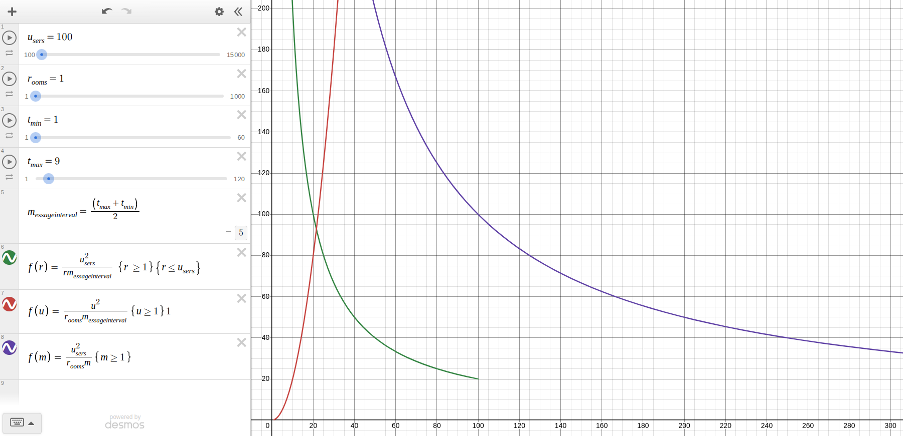

# chat

simple, scalable chat server / load balancer using redis and node.js

$$
\mathrm{r}=\text{rooms},\quad
\mathrm{u}=\text{users},\quad
\mathrm{m}=\frac{t_{min}+t_{max}}{2}
$$

$$
f(r,u,m)=\frac{u^2}{mr}
$$

